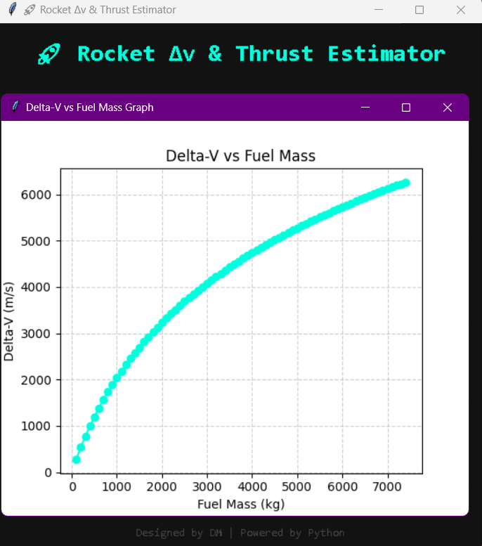
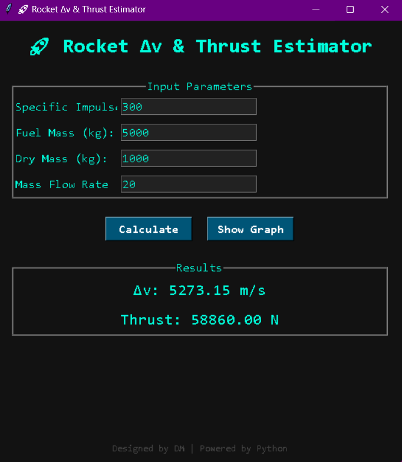
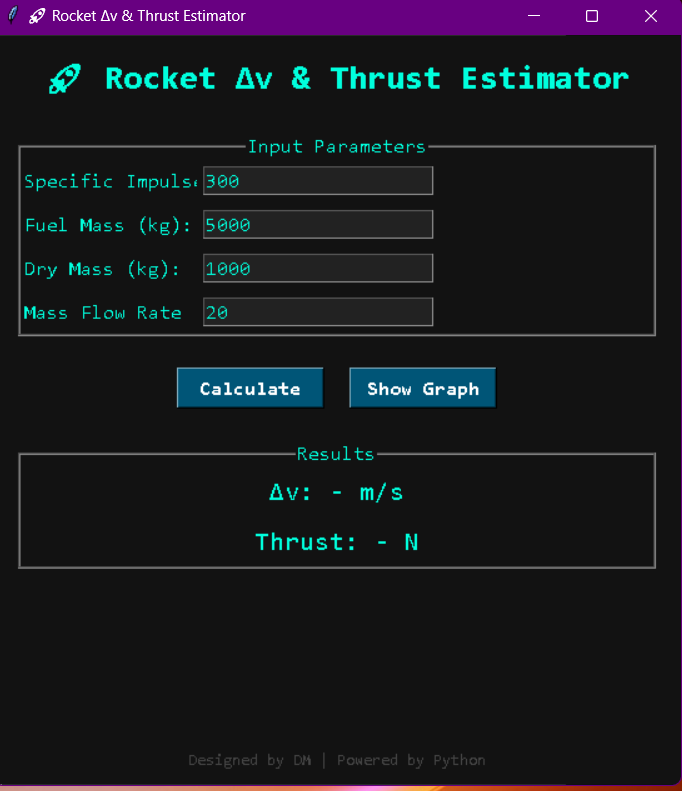
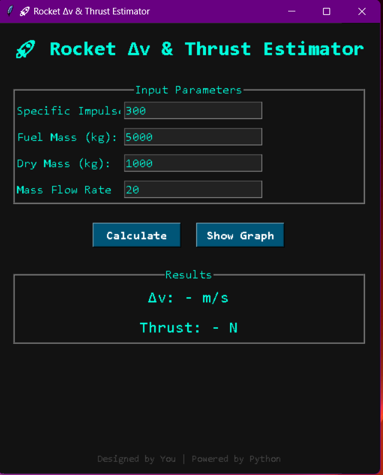

# rocket
# 🚀 Rocket Δv & Thrust Estimator

An interactive **Python + Tkinter** application for estimating a rocket's **Delta-V** and **Thrust** based on **specific impulse, fuel mass, dry mass, and mass flow rate**.  
It also features a **dynamic matplotlib graph** plotting Δv against varying fuel masses.

---

## ✨ Features

- **Delta-V Calculation**
  - Uses the **Tsiolkovsky Rocket Equation**:  
    Δv = Isp × g₀ × ln(m₀ / m_f)
  - Inputs: Specific Impulse, Fuel Mass, Dry Mass

- **Thrust Calculation**
  - Formula: **Thrust = Mass Flow Rate × g₀ × Isp**
  - Inputs: Mass Flow Rate, Specific Impulse

- **Graphing**
  - Plots **Delta-V vs Fuel Mass**
  - Interactive graph embedded in Tkinter window
  - Smooth and customizable matplotlib visuals

- **Error Handling**
  - Validates all inputs and shows **popup warnings** for incorrect values

- **Dark Mode UI**
  - Sleek **dark-themed interface** with custom fonts and colors
  - Responsive window design

---

## 📸 Screenshots

### Row Layout

  
  
  

  
  
 

---

